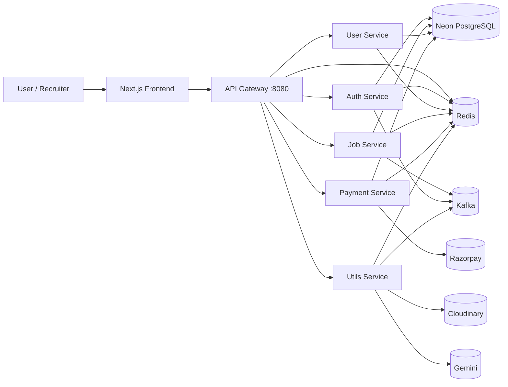
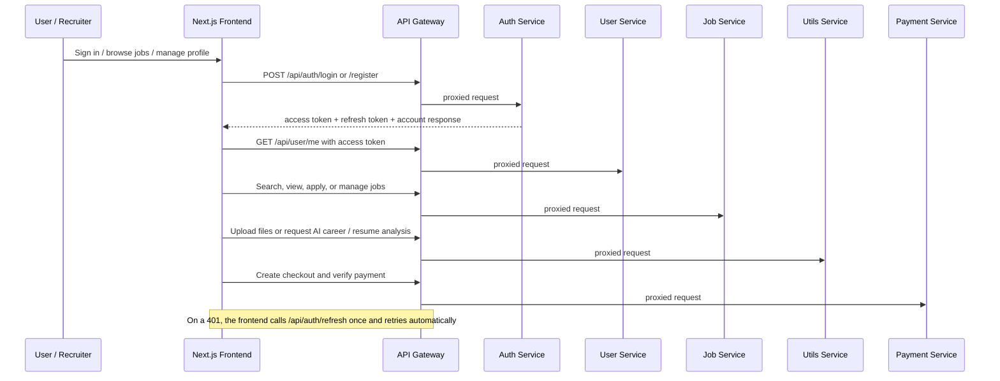

# HireHeaven - AI-Powered Microservices Job Portal


HireHeaven is a modern job portal built with a microservices architecture and a polished Next.js frontend. It connects job seekers, recruiters, and AI-driven career tools into one production-style platform for discovering jobs, managing applications, posting opportunities, analyzing resumes, and generating personalized career guidance.

The project was designed to demonstrate real-world engineering depth: authenticated user flows, role-based experiences, external service integrations, AI-assisted features, service-oriented backend boundaries, and the operational scaffolding (gateway, observability, tests, CI) that separates a demo from a production-style system.

## Key Features

- Role-based experience for job seekers, recruiters, and admins.
- JWT access + refresh token authentication with Redis-backed revocation (logout invalidates both tokens server-side).
- Job browsing, searching, application tracking, and recruiter job posting, with paginated listings.
- Rich Job Detail page: recruiter-defined hiring pipeline (an ordered, expandable stepper), live applicant/CTC/apply-by stat cards, eligibility criteria and custom application questions, tags, required skills, and downloadable JD attachments.
- Recruiter job-posting form with required-field validation (client and server), a round-by-round hiring pipeline builder, and chip inputs for skills/tags/questions.
- **Application Tracker** (`/tracker`): applicants watch their application move through the recruiter's defined rounds on a visual timeline (filterable by company, status, and job type); recruiters bulk-advance applicants through rounds from a "Manage Applicants" panel, which automatically resolves the application to Hired/Rejected once a terminal round is reached.
- Company management for recruiter workflows.
- Admin dashboard (`/admin`, role-gated) for moderation: list/deactivate any job, list/remove any company, list all users.
- AI-powered resume ATS analysis and AI-powered career path recommendations.
- Subscription and payment flow powered by Razorpay.
- File upload support for resumes, profile photos, and company logos.
- Event-driven backend components using Kafka and Redis.
- Redis-backed rate limiting on every service (stricter limits on auth, payment, and AI endpoints) to protect against brute force and abuse.
- Redis cache-aside layer for job listings, job details, company details, and user profiles, with explicit invalidation on writes.
- Zod request validation at every mutating endpoint across all services.
- A single API gateway in front of all five services, so the frontend (and any other client) talks to one origin.
- Structured logging (pino), full Prometheus metrics scraping (`/metrics`), `/health` checks on every service, and pre-provisioned Grafana monitoring dashboards.
- Shared `@hireheaven/common` package (npm workspaces) for error handling, Redis clients, rate limiting, caching, validation, logging, metrics, and tokens — no copy-pasted utilities.
- Automated tests (Vitest) and a GitHub Actions CI pipeline that typechecks, builds, and tests every workspace.
- Cloudinary-based media storage and Gemini-powered AI responses.
- One-command local startup via Docker Compose (Redis, Kafka/Zookeeper, Prometheus, Grafana, the gateway, all five services, and the frontend).

## Project Architecture

The system is a Next.js frontend, an API gateway, and five backend services, all managed as an npm workspaces monorepo. The frontend and every other client talk only to the gateway; the gateway proxies to the right service by path prefix. Each service owns its own responsibility and communicates through HTTP, a shared Postgres database, and asynchronous infrastructure where needed.



Redis serves three purposes here: rate limiting (every service, including the gateway, throttles requests per client IP, with tighter windows on login/register/forgot, payment checkout/verify, and the AI/upload endpoints), cache-aside reads (job listings, job details, company details, and user profiles, invalidated on writes), and auth state (refresh token storage and access/refresh token revocation on logout).

### Workflow Overview



## Tech Stack

| Layer | Technologies |
| --- | --- |
| Frontend | Next.js 16, React 19, TypeScript, Tailwind CSS 4 |
| UI Primitives | Radix UI, Lucide React, next-themes, react-hot-toast |
| HTTP Client | Axios (with an automatic refresh-token interceptor) |
| Auth | JWT access + refresh tokens, Redis-backed revocation, cookies |
| Gateway | Express 5 + http-proxy-middleware |
| Backend | Node.js, Express 5, TypeScript, npm workspaces |
| Validation | Zod |
| Database | Neon PostgreSQL |
| Cache / Rate Limiting | Redis (cache-aside reads + sliding-window rate limiting) |
| Messaging | Kafka / KafkaJS |
| Observability | pino (structured logs), Prometheus (metrics scraper on :9090), Grafana (dashboards on :3001), `/health` & `/metrics` |
| Testing / CI | Vitest, GitHub Actions |
| File Storage | Cloudinary |
| Payments | Razorpay |
| AI Services | Gemini |
| Mail / Notifications | Nodemailer |

## Folder Structure

```text
job-portal/
├── frontend/                  # Next.js application
│   ├── src/
│   │   ├── app/               # App Router pages and routes
│   │   ├── components/        # Shared UI and feature components
│   │   ├── context/           # Global app state, service URLs, refresh-token interceptor
│   │   ├── lib/                # Shared utilities
│   │   └── type.ts            # Shared TypeScript types
│   ├── public/                 # Static assets
│   └── package.json
├── packages/
│   └── common/                 # @hireheaven/common — shared across every service
│       └── src/                # ErrorHandler, TryCatch, redis client, rate limiter,
│                                # cache, zod validate middleware, logger, metrics,
│                                # health check, role guard, access/refresh tokens,
│                                # Kafka client (SASL_SSL-aware)
├── services/
│   ├── gateway/                 # API gateway — single origin for the frontend
│   ├── auth/                    # Authentication microservice
│   ├── job/                     # Job and company microservice
│   ├── payment/                 # Razorpay payment microservice
│   ├── user/                    # Profile, skills, and application microservice
│   └── utils/                   # AI, uploads, and notification utilities
├── monitoring/
│   ├── prometheus/              # Prometheus configuration & scrape targets
│   └── grafana/                 # Pre-provisioned datasources & microservice dashboards
├── .github/workflows/ci.yml     # Typecheck + build + test every workspace
├── Dockerfile.service           # Shared Dockerfile for every backend service + gateway
├── docker-compose.yml           # One-command local stack
└── package.json                 # npm workspaces root
```

## Installation Guide

### Prerequisites

- Node.js 20+ recommended
- npm 10+ recommended
- Docker + Docker Compose (only needed if you want Redis/Kafka/Prometheus/Grafana running locally via the provided `docker-compose.yml`)
- Neon PostgreSQL database (free tier works — the services use `@neondatabase/serverless`, which speaks Neon's HTTP protocol, so a generic local Postgres container will not work as a drop-in replacement)
- Redis instance (local via Docker Compose, or a hosted instance such as Upstash/Redis Cloud)
- Kafka broker (local via Docker Compose, or a Kafka-protocol-compatible hosted instance such as Redpanda Serverless/Confluent Cloud)
- Cloudinary account
- Razorpay account
- Gemini API key

### Quick Start (Docker Compose)

First, copy each `.env.example` to `.env` and fill in your own values (see step 4 of Manual Setup below for the exact commands and which values are required). Then:

```bash
docker compose up --build
```

This starts Redis, Kafka/Zookeeper, Prometheus, and Grafana first, then builds and runs `auth` (5000), `utils` (5001), `user` (5002), `job` (5003), `payment` (5004), the `gateway` (8080), and the `frontend` (3000).

- **Frontend**: [http://localhost:3000](http://localhost:3000)
- **API Gateway**: [http://localhost:8080](http://localhost:8080)
- **Prometheus UI**: [http://localhost:9090](http://localhost:9090)
- **Grafana Dashboards**: [http://localhost:3001](http://localhost:3001) *(login: `admin` / `admin`)*

### Manual Setup

1. Clone the repository.
2. Install all workspace dependencies from the repo root (this installs the frontend, the gateway, all five services, and `@hireheaven/common` in one pass, and symlinks the shared package):

```bash
npm install
```

3. Build the shared package once before running any service in dev mode (their `npm run dev` scripts assume `@hireheaven/common`'s `dist/` already exists):

```bash
npm run build --workspace=@hireheaven/common
```

4. Each service ships a `.env.example` (committed) — copy it to `.env` (gitignored, never committed) and fill in your own values:

```bash
cp services/auth/.env.example services/auth/.env
cp services/job/.env.example services/job/.env
cp services/user/.env.example services/user/.env
cp services/payment/.env.example services/payment/.env
cp services/utils/.env.example services/utils/.env
cp frontend/.env.example frontend/.env
```

`PORT`, `Redis_url` (`redis://localhost:6379`), and `Kafka_Broker` (`localhost:9092`) already have working local defaults. You need to fill in: a `JWT_SEC` (any random string, but the **same value** in `auth`/`job`/`payment`/`user` since tokens issued by auth must verify in the others — generate one with `node -e "console.log(require('crypto').randomBytes(32).toString('hex'))"`), `DB_URL` (Neon), Cloudinary keys, `Razorpay_Key`/`Razorpay_Secret`, and `GOOGLE_API_KEY`. **Never commit a `.env` file with real values — only `.env.example` (placeholders) is tracked in git.**
5. Start Redis and Kafka yourself (or via `docker compose up redis zookeeper kafka`) if you're running services with `npm run dev` instead of Docker Compose.

## Environment Variables

### Auth Service (`services/auth/.env`)

```env
PORT=5000
DB_URL=your_neon_postgres_connection_string
UPLOAD_SERVICE=http://localhost:5001
JWT_SEC=your_jwt_secret
Kafka_Broker=localhost:9092
KAFKA_USERNAME=
KAFKA_PASSWORD=
KAFKA_SASL_MECHANISM=scram-sha-256
Frontend_Url=http://localhost:3000
Redis_url=redis://localhost:6379
```

### User Service (`services/user/.env`)

```env
PORT=5002
DB_URL=your_neon_postgres_connection_string
UPLOAD_SERVICE=http://localhost:5001
JWT_SEC=your_jwt_secret
Redis_url=redis://localhost:6379
```

### Job Service (`services/job/.env`)

```env
PORT=5003
DB_URL=your_neon_postgres_connection_string
UPLOAD_SERVICE=http://localhost:5001
JWT_SEC=your_jwt_secret
Kafka_Broker=localhost:9092
KAFKA_USERNAME=
KAFKA_PASSWORD=
KAFKA_SASL_MECHANISM=scram-sha-256
Redis_url=redis://localhost:6379
```

### Payment Service (`services/payment/.env`)

```env
PORT=5004
Razorpay_Key=your_razorpay_key_id
Razorpay_Secret=your_razorpay_secret
DB_URL=your_neon_postgres_connection_string
JWT_SEC=your_jwt_secret
Redis_url=redis://localhost:6379
```

### Utils Service (`services/utils/.env`)

```env
PORT=5001
CLOUD_NAME=your_cloudinary_cloud_name
API_KEY=your_cloudinary_api_key
API_SECRET=your_cloudinary_api_secret
Kafka_Broker=localhost:9092
KAFKA_USERNAME=
KAFKA_PASSWORD=
KAFKA_SASL_MECHANISM=scram-sha-256
SMTP_USER=your_smtp_email@gmail.com
SMTP_PASS=your_smtp_app_password
GOOGLE_API_KEY=your_gemini_api_key
Redis_url=redis://localhost:6379
```

`KAFKA_USERNAME`/`KAFKA_PASSWORD` are only needed for a hosted broker that requires SASL_SSL auth (e.g. Redpanda Serverless, Confluent Cloud) — leave both blank for a local/plaintext broker (e.g. via `docker-compose`). `KAFKA_SASL_MECHANISM` defaults to `scram-sha-256` but can be overridden (e.g. `scram-sha-512`, `plain`) to match whatever your broker requires. `auth` and `job` publish to the `send-mail` topic (password resets, application status emails); `utils` consumes it and actually sends the mail via Nodemailer. If Kafka is unreachable or unconfigured, these two email notifications silently don't fire — everything else in the app is unaffected.

### Gateway (`services/gateway`)

The gateway has no `.env` file committed (it holds no secrets) — configure it via environment variables, all optional with sane local defaults:

```env
PORT=8080
Redis_url=redis://localhost:6379
AUTH_SERVICE_URL=http://localhost:5000
UTILS_SERVICE_URL=http://localhost:5001
USER_SERVICE_URL=http://localhost:5002
JOB_SERVICE_URL=http://localhost:5003
PAYMENT_SERVICE_URL=http://localhost:5004
```

### Frontend Configuration (`frontend/.env`)

The frontend talks to the gateway by default. Set an individual `NEXT_PUBLIC_*_SERVICE_URL` only if you want to bypass the gateway and hit one service directly (e.g. while debugging):

```env
NEXT_PUBLIC_API_GATEWAY_URL=http://localhost:8080

# NEXT_PUBLIC_AUTH_SERVICE_URL=http://localhost:5000
# NEXT_PUBLIC_UTILS_SERVICE_URL=http://localhost:5001
# NEXT_PUBLIC_USER_SERVICE_URL=http://localhost:5002
# NEXT_PUBLIC_JOB_SERVICE_URL=http://localhost:5003
# NEXT_PUBLIC_PAYMENT_SERVICE_URL=http://localhost:5004
```

For a deployed environment, point `NEXT_PUBLIC_API_GATEWAY_URL` at your deployed gateway URL.

## Running the Project

Each service can be started independently. Build `@hireheaven/common` first (step 3 in Manual Setup above) — every service imports it.

### Frontend

```bash
cd frontend
npm run dev
```

### Backend Services + Gateway

```bash
cd services/gateway && npm run dev
cd services/auth && npm run dev
cd services/job && npm run dev
cd services/payment && npm run dev
cd services/user && npm run dev
cd services/utils && npm run dev
```

### Production Build

From the repo root, this builds `@hireheaven/common` and every workspace that has a `build` script (all five services, the gateway, and the frontend):

```bash
npm run build --workspaces --if-present
```

Then start each with `npm start` from its own directory (or `node dist/index.js` for the backend services/gateway, `npm start` for the frontend).

## Testing & CI

Every workspace (the shared package, all five services, and the gateway) has a Vitest suite covering validation schemas, rate limiting, caching, token issuance/revocation, and role guards — using an in-memory fake Redis client, so tests run without any real infrastructure.

```bash
npm run typecheck --workspaces --if-present   # tsc --noEmit everywhere
npm run build --workspaces --if-present       # compile everything, including the frontend
npm run test --workspaces --if-present        # run every Vitest suite
```

`.github/workflows/ci.yml` runs the same three commands (in that order, since services depend on `@hireheaven/common`'s build output) on every push and pull request to `main`.

## Deployment

Every backend service and the gateway share `Dockerfile.service` at the repo root (the build context is the repo root, not the individual service folder, since they all depend on the `@hireheaven/common` workspace package); the frontend keeps its own self-contained `Dockerfile`.

- **Frontend**: deploy to Vercel (native Next.js support) or as the `frontend` container to any Docker host; set `NEXT_PUBLIC_API_GATEWAY_URL` to your deployed gateway's URL.
- **Gateway**: deploy as its own container (`docker build -f Dockerfile.service --build-arg SERVICE=gateway .`) to Render, Railway, Fly.io, or any container platform. Set `AUTH_SERVICE_URL`, `UTILS_SERVICE_URL`, `USER_SERVICE_URL`, `JOB_SERVICE_URL`, and `PAYMENT_SERVICE_URL` to each service's deployed URL, and `Redis_url` to your managed Redis instance.
- **Backend services**: deploy each (`auth`, `user`, `job`, `payment`, `utils`) as its own container the same way (`--build-arg SERVICE=<name>`). Set each service's environment variables (from the tables above) in that platform's dashboard/secrets manager rather than committing real values.
- **Redis**: use a managed instance (Upstash, Redis Cloud, or your platform's managed Redis add-on) and point every service's `Redis_url` at it — it's shared state for rate limiting, caching, and auth token revocation, so all services must point at the same instance.
- **Kafka**: use a Kafka-protocol-compatible managed instance (Redpanda Serverless, Confluent Cloud) on `auth`, `job`, and `utils`, setting `Kafka_Broker` plus `KAFKA_USERNAME`/`KAFKA_PASSWORD` (and `KAFKA_SASL_MECHANISM` if your provider doesn't use the `scram-sha-256` default). All Kafka calls are wrapped in try/catch and log-and-continue on failure, so the app still runs (without password-reset/application-status emails) if Kafka is unreachable or left unconfigured.
- **Database**: Neon PostgreSQL is already serverless and requires no separate hosting — just use your project's connection string as `DB_URL` in each deployed service.
- `docker-compose.yml` at the repo root is intended for local development; for production, run each service as its own deployment so they can scale and fail independently, which is the point of a microservices architecture.

### Production URLs & Cross-Service Env Vars

Deployed service URLs (Render for the backend services/gateway, Vercel for the frontend):

| Service | URL |
| --- | --- |
| Gateway | `https://ai-microservices-job-portal-gateway.onrender.com` |
| Auth | `https://ai-microservices-job-portal-nl5v.onrender.com` |
| Utils | `https://ai-microservices-job-portal.onrender.com` |
| User | `https://ai-microservices-job-portal-user.onrender.com` |
| Job | `https://ai-microservices-job-portal-job.onrender.com` |
| Payment | `https://ai-microservices-job-portal-payment.onrender.com` |
| Frontend | `https://ai-microservices-job-portal-fronten.vercel.app` |

These are set in each platform's dashboard (never committed to `.env`). On top of the secrets already configured (DB, Cloudinary, Kafka, etc. — see the tables above), set the following cross-service URLs so the deployed services can actually reach each other:

| Service (dashboard) | Env var | Value |
| --- | --- | --- |
| Gateway | `AUTH_SERVICE_URL` | `https://ai-microservices-job-portal-nl5v.onrender.com` |
| Gateway | `UTILS_SERVICE_URL` | `https://ai-microservices-job-portal.onrender.com` |
| Gateway | `USER_SERVICE_URL` | `https://ai-microservices-job-portal-user.onrender.com` |
| Gateway | `JOB_SERVICE_URL` | `https://ai-microservices-job-portal-job.onrender.com` |
| Gateway | `PAYMENT_SERVICE_URL` | `https://ai-microservices-job-portal-payment.onrender.com` |
| Auth | `UPLOAD_SERVICE` | `https://ai-microservices-job-portal.onrender.com` (utils) |
| Auth | `Frontend_Url` | `https://ai-microservices-job-portal-fronten.vercel.app` |
| Job | `UPLOAD_SERVICE` | `https://ai-microservices-job-portal.onrender.com` (utils) |
| User | `UPLOAD_SERVICE` | `https://ai-microservices-job-portal.onrender.com` (utils) |
| Frontend (Vercel) | `NEXT_PUBLIC_API_GATEWAY_URL` | `https://ai-microservices-job-portal-gateway.onrender.com` |

Payment and Utils don't call any other service, so they need no cross-service URL beyond what's already in their tables above. `.github/workflows/keep-alive.yml` pings the gateway and all five backend services' `/health` endpoints every 10 minutes to keep Render's free tier from spinning them down after ~15 minutes idle — this reduces cold starts significantly but isn't a hard guarantee (Render still sleeps services during redeploys/maintenance, and a gateway request still fails if a specific downstream service happens to be asleep between pings). Vercel's frontend doesn't need this — it isn't on a sleeping free-tier container.

## API Endpoints

All endpoints below are reachable through the gateway at its own origin (default `http://localhost:8080`) using the same paths, e.g. `http://localhost:8080/api/auth/login`.

### Auth Service

| Method | Endpoint | Description |
| --- | --- | --- |
| POST | `/api/auth/register` | Register a user with profile upload support |
| POST | `/api/auth/login` | Authenticate and issue an access + refresh token pair |
| POST | `/api/auth/refresh` | Exchange a refresh token for a new access + refresh token pair (rotates the refresh token) |
| POST | `/api/auth/logout` | Revoke the current access token and refresh token |
| POST | `/api/auth/forgot` | Start password reset flow |
| POST | `/api/auth/reset/:token` | Complete password reset |

### User Service

| Method | Endpoint | Description |
| --- | --- | --- |
| GET | `/api/user/me` | Get the authenticated user profile |
| GET | `/api/user/admin/users` | **Admin only.** List all users, paginated |
| GET | `/api/user/:userId` | Get public user details (cached) |
| PUT | `/api/user/update/profile` | Update basic profile fields |
| PUT | `/api/user/update/pic` | Update profile image |
| PUT | `/api/user/update/resume` | Update resume file |
| POST | `/api/user/skill/add` | Add a skill |
| PUT | `/api/user/skill/delete` | Remove a skill |
| POST | `/api/user/apply/job` | Apply for a job — seeds the application's first hiring-round stage automatically |
| GET | `/api/user/application/all` | List the current user's applications, paginated (includes company name/logo and job type, for the Tracker) |

### Job Service

| Method | Endpoint | Description |
| --- | --- | --- |
| GET | `/api/job/admin/jobs` | **Admin only.** List every job (active and inactive), paginated |
| PUT | `/api/job/admin/jobs/:jobId/active` | **Admin only.** Activate or deactivate any job |
| GET | `/api/job/admin/companies` | **Admin only.** List every company with its job count, paginated |
| POST | `/api/job/company/new` | Create a new company |
| DELETE | `/api/job/company/:companyId` | Delete a company (owner or admin) |
| GET | `/api/job/company/all` | List recruiter companies |
| GET | `/api/job/company/:id` | Get company details (cached) |
| POST | `/api/job/new` | Create a job posting, including its hiring rounds, tags, skills, and application questions (owner or admin) |
| PUT | `/api/job/:jobId` | Update a job posting; hiring rounds are only replaceable while no applications exist yet, to keep applicant progress from pointing at a round that got reshuffled out from under it (owner or admin) |
| POST | `/api/job/:jobId/attachments` | Upload a JD PDF (or other document) to a job posting (owner or admin) |
| GET | `/api/job/all` | Get active jobs, paginated and filterable by title/location (cached) |
| GET | `/api/job/:jobId` | Get a single job — including its rounds, tags, skills, questions, attachments, and applicant count (cached) |
| GET | `/api/job/application/:jobId` | Get applications for a job, paginated (owner or admin) |
| PUT | `/api/job/application/update/:id` | Update an application's overall status (owner or admin) |
| GET | `/api/job/application/:id/summary` | Resolve who an application belongs to, for authorization checks (applicant, job owner, or admin) |
| GET | `/api/job/application/:id/history` | Get an application's full round-by-round stage history, oldest first (applicant, job owner, or admin) |
| PUT | `/api/job/application/stage` | Bulk-advance one or more applications to a hiring round with a status and optional note; auto-resolves the application to Hired/Rejected on a terminal round (owner or admin) |

### Payment Service

| Method | Endpoint | Description |
| --- | --- | --- |
| POST | `/api/payment/checkout` | Create a Razorpay checkout order |
| POST | `/api/payment/verify` | Verify payment success |

### Utils Service

| Method | Endpoint | Description |
| --- | --- | --- |
| POST | `/api/utils/upload` | Upload or replace media in Cloudinary |
| POST | `/api/utils/career` | Generate career guidance using Gemini |
| POST | `/api/utils/resume-analyser` | Analyze a resume for ATS compatibility |

### Operational & Observability Endpoints

Every service (including the gateway) exposes:

| Method | Endpoint | Description |
| --- | --- | --- |
| GET | `/health` | Liveness check — service name + timestamp |
| GET | `/metrics` | Prometheus-format metrics (request duration histogram, request counter, in-flight gauge, cache hit/miss, rate limit counters, process metrics) |

### Monitoring & Dashboards

| Service | Port / URL | Description |
| --- | --- | --- |
| **Prometheus** | `http://localhost:9090` | Scrapes `/metrics` from Gateway and all 5 microservices every 5s |
| **Grafana** | `http://localhost:3001` | Pre-provisioned dashboards for service health, RPS, P95 latencies, error rates, RSS memory, and Redis cache performance (credentials: `admin` / `admin`) |

## Screenshots

### Home Page


<details>
<summary>Dark mode</summary>


</details>

### Job Listings


### Job Details

Stat cards (applicants, CTC, apply-by countdown), an expandable hiring-process stepper driven entirely by rounds the recruiter defines, eligibility criteria, tags, skills, and JD attachments.


### Recruiter Job Posting

Required-field validation, a round-by-round hiring pipeline builder, and chip inputs for skills/tags/questions.


### Application Tracker

Applicants watch their application move through the recruiter's rounds on a live timeline, filterable by company, status, and job type.


### Manage Applicants (Recruiter)

Bulk-advance selected applicants to a round with a status and optional note — the final round auto-resolves the application to Hired or Rejected.


### Company / Recruiter Dashboard


### Admin Dashboard


### About


### Contact


### AI Career Guide


### AI Resume Analyzer


## Future Improvements

- Add Kubernetes manifests / Helm chart for production orchestration beyond the local Docker Compose setup.
- Add distributed tracing (e.g. OpenTelemetry) across the gateway and services, correlated by request ID.
- Add sorting and advanced filters (salary range, job type, work location) to the job search flow.
- Use a proper secrets manager (e.g. your deployment platform's env var store, or Doppler/Vault) instead of local `.env` files as the project grows beyond a single deployer.
- Add end-to-end tests (Playwright/Cypress) covering the full signup → apply → payment flow through the gateway.
- Add token-bucket or per-user (not just per-IP) rate limiting for authenticated endpoints.

## Challenges Solved

- Coordinating a multi-service architecture without losing feature cohesion.
- Keeping recruiter, job seeker, and admin flows separate while sharing a common UX and auth model.
- Managing authenticated requests across services with short-lived access tokens, refresh rotation, and Redis-backed revocation.
- Fronting five independently deployable services with a single gateway without breaking existing route contracts.
- Sharing code (error handling, Redis, validation, logging, metrics, tokens) across services via an npm workspaces package instead of copy-pasting it five times.
- Handling binary uploads for resumes, logos, and profile media.
- Returning structured JSON from AI models reliably enough for UI rendering.
- Integrating payment, messaging, storage, and AI systems into one workflow.
- Modeling a recruiter-defined, per-job hiring pipeline (rather than a fixed global one) while keeping a separate, simpler application status untouched for backward compatibility — new stage-tracking data is additive, not a breaking migration of the original schema.
- Making multi-table writes (a job plus its rounds/tags/skills/questions) atomic on a serverless HTTP-only Postgres driver that doesn't support interactive transactions the way a pooled connection would.

## Learning Outcomes

- Microservices design, service boundary definition, and API gateway patterns.
- Access/refresh token authentication with server-side revocation, and role-based authorization (jobseeker/recruiter/admin).
- Frontend state orchestration with React context, including a transparent token-refresh interceptor.
- Database modeling for job portals, applications, and user skills, including a zero-downtime enum migration (adding the `admin` role).
- Practical integration of third-party APIs and hosted services.
- Testable Node.js services: dependency-injectable Redis clients, pure validation schemas, and fast unit tests with no live infrastructure.
- Real-world TypeScript patterns across a monorepo, frontend and backend alike.

## Why This Project Stands Out

- It combines a polished consumer-facing frontend with a production-style distributed backend, including a gateway, observability, and CI.
- It solves a real hiring workflow end to end, from discovery to application to payment, with admin moderation on top.
- It adds AI features that are useful rather than ornamental: resume analysis and career guidance.
- It demonstrates integration depth across databases, storage, caching, messaging, payments, and authentication.
- It is recruiter-friendly because the domain, architecture, and feature scope are immediately understandable — and it holds up under scrutiny: tests pass, builds are clean, and the deployment story is documented.

## License

Licensed under the ISC License.
